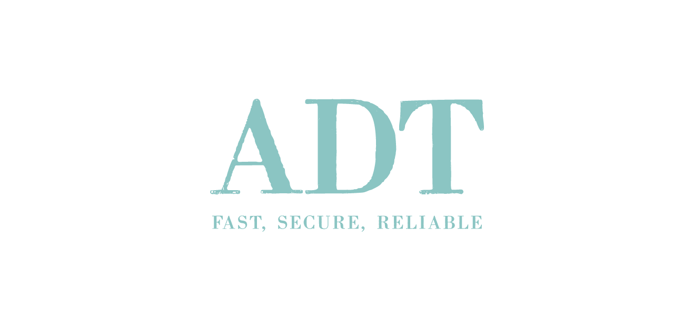

<p align="center">
  <br />
  <br />
  <a href="https://github.com/ashishkpathak/adt">
    
  </a>
</p>

<!-- Badges -->
<p align="center">
  <!-- CI -->
  <a href="https://ci.appveyor.com/api/projects/status/5n0s6lbigi8wji96/branch/main?svg=true">
    
  </a>
  
  <!-- Github version -->
 
  <!-- <a href="releases">
    
  </a> -->
    
  <!-- License -->
  <a href="LICENSE">
    
  </a>

</p>

<br />
<p align="center">
  <a href="#-quick-start"><b>Quick Start</b></a> •
  <a href="#-features"><b>Features</b></a> •
  <a href="#-contributing"><b>Contributing</b></a> •
  <a href="#-license"><b>License</b></a> •
</p>
<br />

## _Apigee Edge Deployment Tool_

## 🚀 Quick Start
ADT is command-line tool for deploying Apigee entities like API proxies, API products, Apps, Shared-flows, KVMs to your Apigee Edge public or private cloud.

ADT can be used to create, deploy, list.

- [API Proxy](docs/api-proxy)
- [API Products](docs/api-products)
- [Shared Flows](docs/shared-flows)
- [KVM](docs/key-value-maps)
- [Environments](docs/environments)
- [Debug Session](docs/debugsessions)
- [Developers](docs/developers)
- [Developer Apps](docs/apps)
- [Deployments](docs/deployments)
- [Company Apps](docs/apps)
- [Users](docs/users)
- [Roles](docs/roles)
- [Alerts^](docs/alerts)
- [Analytics^](docs/analytics)
- [Reports^](docs/reports)
- [Cache](docs/cache)
- [Tokens](docs/oauth20)
- [Target Servers](docs/target-servers)
- [Policies^](docs/policies)
- [Resources^](docs/resources)
- [Virtual Hosts^](docs/virtual-hosts)
- [Stats^](docs/stats)
- [Organizations^](docs/organizations)
- [Audit^](docs/audit)
- ✨Magic ✨

[^] Contact author for these features.
## ✨ Features

- Create an empty API Proxy template, have it created and deployed to Apigee Edge.
- Validate your proxies/shared-flow policies for XML syntax and consistences.
- Download API proxy revisions.
- Query OAuth2.0 tokens
- Export proxies, shared-flows, products.

## Installation

ADT

Install the command line tool and initialize it for your environment. 

[Installation/Setup](docs/initialize/README.md)


## ❓ Help

```sh
A.D.T
Apigee Deployment Tool
Usage: adt [-hV] [COMMAND]
ADT is a fast, secure and reliable way to manage your entities on Apigee.
  -h, --help      Show this help message and exit.
  -V, --version   Print version information and exit.
Commands:
  create    Create operations on various apigiee entities (apps, developer, proxies, products etc)
  deploy    Deploy apiproxy and shared-flows.
  init      Initialise adt environment
  undeploy  Undeploy apiproxies and shared-flows.
  delete    Remove various entities.
  list      List operations on proxies/kvm/products etc.
  query     Query OAuth 2.0/ 1.0a tokens.
  update    Update apps, developer, proxies, products etc
Version 1.0.0
```


## 🤝 Contributing

Contact authors(adt@pathak.id.au).


## License

Copyright pathak.id.au, Inc. or its affiliates. All Rights Reserved.

Permission is hereby granted, free of charge, to any person obtaining a copy of this
software and associated documentation files (the "Software"), to deal in the Software
without restriction, including without limitation the rights to use, copy, modify,
merge, publish, distribute, sublicense, and/or sell copies of the Software, and to
permit persons to whom the Software is furnished to do so.

THE SOFTWARE IS PROVIDED "AS IS", WITHOUT WARRANTY OF ANY KIND, EXPRESS OR IMPLIED,
INCLUDING BUT NOT LIMITED TO THE WARRANTIES OF MERCHANTABILITY, FITNESS FOR A
PARTICULAR PURPOSE AND NONINFRINGEMENT. IN NO EVENT SHALL THE AUTHORS OR COPYRIGHT
HOLDERS BE LIABLE FOR ANY CLAIM, DAMAGES OR OTHER LIABILITY, WHETHER IN AN ACTION
OF CONTRACT, TORT OR OTHERWISE, ARISING FROM, OUT OF OR IN CONNECTION WITH THE
SOFTWARE OR THE USE OR OTHER DEALINGS IN THE SOFTWARE.
