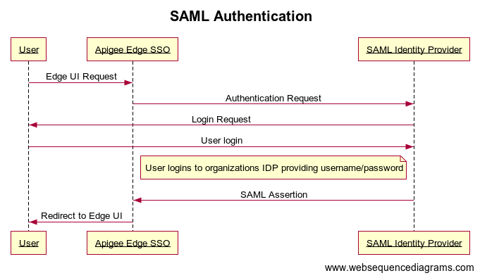

## SAML Authentication

In this diagram:

- User attempts to access the Edge UI by making a request to the login domain for the Edge SSO, which includes the zone name. For example, https://zonename.login.apigee.com
- Unauthenticated requests to https://zonename.login.apigee.com are redirected to the customer's SAML identity provider. For example, https://idp.company.com.
- If customer is not logged in to the identity provider, the customer is prompted to log in.
- The user is authenticated by the SAML identity provider. The SAML identity provider generates and returns a SAML 2.0 assertion to the Edge SSO.
- Edge SSO validates the assertion, extracts the user identity from the assertion, generates the OAuth 2.0 authentication token for the Edge UI, and redirects the user to the main Edge UI page at:

https://zonename.apigee.com/platform/orgName

Where orgName is the name of an Edge organization. This endpoint could be different to your organization. Check with your system administrator.

The <zonename> is to be replaced with domain specific to your organization 

